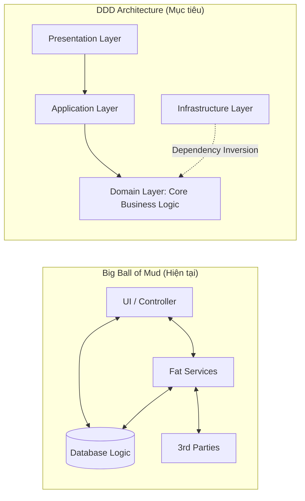
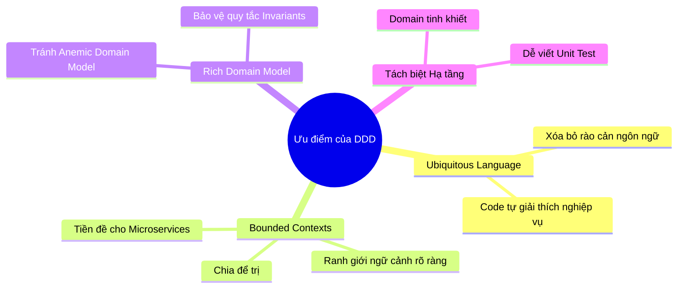
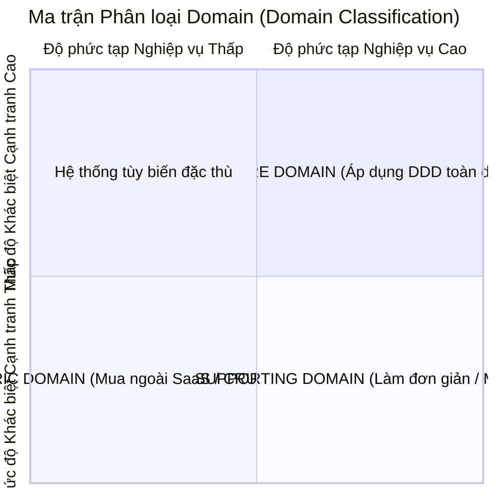

# [BÀI TẬP] TƯ DUY THIẾT KẾ THEO DOMAIN (DOMAIN-DRIVEN DESIGN - DDD)
**Chủ đề:** Phân tích Triết lý DDD, Ưu - Nhược điểm và Đánh giá tính khả thi khi giải cứu dự án khỏi "Big Ball of Mud"  
**Mức độ:** Bài tập Giỏi (Bài tập 3)  
**Repository:** [NamNT2942003/Microservice-session1](https://github.com/NamNT2942003/Microservice-session1)

---

## 1. Đặt vấn đề & Bản chất triết lý của DDD

> **Bối cảnh:** Một dự án sau thời gian dài phát triển ngày càng phình to, mã nguồn trở thành **"một đống bùn lầy" (Big Ball of Mud)**: các luồng xử lý đan xen chéo cánh, logic nghiệp vụ nằm rải rác từ UI, Controller, Service đến Stored Procedures trong Database. Team Leader đề xuất áp dụng **Domain-Driven Design (DDD)** để tái cấu trúc.

### Triết lý cốt lõi của DDD:
- **Phần mềm sinh ra là để phục vụ bài toán kinh doanh:** Trái tim của một hệ thống phần mềm không phải là framework, công nghệ hay cơ sở dữ liệu hiện đại, mà chính là **năng lực giải quyết đúng và trọn vẹn nghiệp vụ cốt lõi (Core Business Domain)** của doanh nghiệp.
- **DDD không phải là công nghệ (Technology-agnostic):** DDD là phương pháp luận tư duy thiết kế phần mềm, đưa các chuyên gia nghiệp vụ (*Domain Experts*) và các kỹ sư phần mềm (*Developers*) về cùng một góc nhìn để mô hình hóa thế giới thực vào mã nguồn.

---

## 2. Phân tích Ưu điểm của DDD

DDD mang lại sức mạnh vượt trội khi xử lý các hệ thống có nghiệp vụ phức tạp thông qua các giá trị cốt lõi:

### 2.1. Ngôn ngữ chung (Ubiquitous Language)
- **Giải quyết vấn đề:** Trong phát triển phần mềm truyền thống, lập trình viên thường dùng từ ngữ kỹ thuật (*Table, Foreign Key, Row, Flag, DTO*), còn khách hàng/chuyên gia dùng thuật ngữ nghiệp vụ (*Hợp đồng, Bồi thường, Ký quỹ, Quyết toán*). Sự lệch pha này dẫn đến tình trạng "tam sao thất bản" (*Lost in Translation*).
- **Giá trị của DDD:** Xây dựng một bộ từ vựng chung thống nhất và duy nhất, được sử dụng xuyên suốt từ cuộc họp nghiệp vụ, tài liệu thiết kế, sơ đồ kiến trúc cho đến tên class, method và biến trong mã nguồn. Code trở thành tài liệu sống phản ánh chính xác nghiệp vụ.

### 2.2. Gắn kết chặt chẽ giữa nghiệp vụ và code (Rich Domain Model)
- **Xóa bỏ mô hình thiếu máu (Anemic Domain Model):** Trong cách viết truyền thống, các Entity thường chỉ là các Data Holder chứa Getter/Setter rỗng tuếch, còn toàn bộ logic bị nhét vào các "Fat Service" khổng lồ hàng nghìn dòng.
- **Mô hình hóa giàu hành vi:** DDD đưa logic nghiệp vụ và các quy tắc kiểm tra tính hợp lệ (Validation/Invariants) vào đúng các *Entities* và *Value Objects*. Một Entity không chỉ chứa dữ liệu mà còn chứa hành vi thực hiện trên dữ liệu đó.

### 2.3. Phân định ranh giới rõ ràng (Bounded Contexts & Context Mapping)
- **Chia để trị (Divide and Conquer):** Thay vì cố gắng tạo ra một mô hình dữ liệu dùng chung duy nhất cho toàn công ty (Enterprise-wide Data Model - điều gần như bất khả thi), DDD chia hệ thống thành các ngữ cảnh giới hạn (**Bounded Contexts**).
- Ví dụ: Đối tượng `User` ở *Authentication Context* chỉ cần `username/password`, nhưng ở *Billing Context* là `Customer` với `Mã số thuế, Địa chỉ xuất hóa đơn`, ở *Delivery Context* là `Recipient` với `Số điện thoại, Tọa độ giao hàng`.
- Đây chính là **kim chỉ nam hoàn hảo nhất để xác định ranh giới chia Microservices** mà không bị rơi vào bẫy *Distributed Monolith*.

### 2.4. Độc lập hoàn toàn với hạ tầng (Infrastructure Independence)
- Bằng cách áp dụng **Clean Architecture / Hexagonal Architecture (Ports & Adapters)**, tầng Domain được đặt ở vị trí trung tâm, hoàn toàn không phụ thuộc vào Database (SQL/NoSQL), UI hay thư viện bên ngoài.
- Điều này giúp mã nguồn nghiệp vụ cực kỳ trong sáng, dễ viết **Unit Test** nhanh chóng mà không cần mock database phức tạp.

---

## 3. Phân tích Nhược điểm & Thách thức thực tế của DDD

Dù rất mạnh mẽ, DDD không phải là phương thuốc vạn năng và đi kèm những cái giá rất đắt:

| Thách thức | Chi tiết biểu hiện | Tác động thực tế đến dự án |
| :--- | :--- | :--- |
| **1. Đường cong học tập cực dốc (Steep Learning Curve)** | DDD chứa đựng một hệ sinh thái thuật ngữ trừu tượng đồ sộ: *Strategic Design (Subdomains, Bounded Context, Context Map)* và *Tactical Design (Entities, Value Objects, Aggregates, Aggregate Root, Domain Events, Repositories, Domain Services, Factories)*. | Đội ngũ lập trình viên mất rất nhiều thời gian để hiểu đúng. Nếu áp dụng nửa vời hoặc hiểu sai sẽ tạo ra mã nguồn rườm rà, khó hiểu hơn cả code cũ. |
| **2. Tốn nhiều thời gian hội thảo nghiệp vụ (Event Storming)** | Để xây dựng mô hình đúng, cần tổ chức nhiều buổi workshop chuyên sâu với các chuyên gia nghiệp vụ (*Domain Experts / Product Owners*). | Các Domain Experts thường rất bận rộn với công việc kinh doanh và khó dành hàng tuần để ngồi họp chi tiết với đội ngũ dev. |
| **3. Nguy cơ Over-engineering với bài toán đơn giản** | Áp dụng đầy đủ Tactical DDD cho các tính năng CRUD đơn giản (chỉ thêm, sửa, xóa hiển thị) sẽ tạo ra quá nhiều lớp trung gian (Entities, Value Objects, DTOs, Mappers, Repositories). | Làm chậm tốc độ phát triển tính năng mới một cách không cần thiết, lãng phí thời gian và ngân sách của công ty. |
| **4. Thách thức chuyển đổi tư duy (Mindset Shift)** | Phần lớn lập trình viên quen với tư duy thiết kế hướng CSDL (*Database-First / Table-First*), quen dùng Transaction của RDBMS để bảo đảm toàn vẹn dữ liệu. | Rất khó để thay đổi sang tư duy hướng nghiệp vụ (*Domain-First*), thiết kế Aggregate nhỏ và chấp nhận tính nhất quán sau cùng (*Eventual Consistency*). |

---

## 4. Đánh giá tính khả thi: Có nên áp dụng DDD để giải cứu "Big Ball of Mud"?

Để giải cứu dự án hiện tại, **Team Leader không nên áp dụng DDD một cách máy móc và ồ ạt toàn bộ**, mà cần phân loại hệ thống theo ma trận Domain:

### Lộ trình thực thi khuyến nghị:

1. **Bước 1: Áp dụng Strategic DDD trước (Không sửa code ngay)**
   - Tổ chức workshop **Event Storming** để vẽ lại toàn bộ luồng sự kiện nghiệp vụ của hệ thống.
   - Xác định rõ đâu là **Core Domain** (mang lại doanh thu/lợi thế cạnh tranh), đâu là **Supporting/Generic Domain**.
   - Vẽ lại bản đồ ngữ cảnh (**Context Map**) và phân định các **Bounded Contexts**.

2. **Bước 2: Chỉ áp dụng Tactical DDD cho Core Domain**
   - Không lãng phí thời gian refactor toàn bộ hệ thống bằng DDD. 
   - Giữ các phần Generic/Supporting Domain ở dạng CRUD hoặc Service layer đơn giản.
   - Chỉ áp dụng quy chuẩn Aggregate Root, Value Objects, Domain Events vào các phân hệ nghiệp vụ cốt lõi, thường xuyên thay đổi và có logic phức tạp.

3. **Bước 3: Thiết lập Bức tường chống tha hóa (Anticorruption Layer - ACL)**
   - Khi viết module mới theo chuẩn DDD, sử dụng tầng ACL để kết nối với phần code "Big Ball of Mud" cũ, ngăn không cho thiết kế lộn xộn cũ làm ô nhiễm mô hình nghiệp vụ mới.

---

## 5. Kết luận

DDD là **kim chỉ nam tối thượng cho các hệ thống phần mềm có độ phức tạp nghiệp vụ cao**. Thành công của DDD nằm ở việc nhận thức rõ ràng:
> *"Công nghệ chỉ là công cụ hỗ trợ; thấu hiểu và mô hình hóa chính xác nghiệp vụ cốt lõi của doanh nghiệp mới là yếu tố quyết định sự sống còn của phần mềm."*
