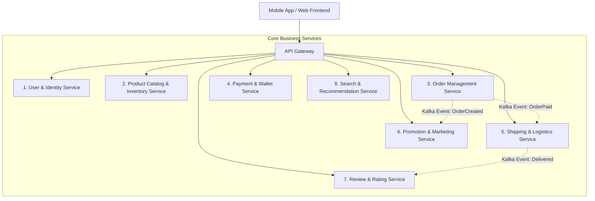

# [BÀI TẬP 4 - GIỎI] PHÂN RÃ SHOPEE THEO KHẢ NĂNG KINH DOANH (BUSINESS CAPABILITY)
**Chủ đề:** Áp dụng phương pháp phân rã Top-Down theo Năng lực nghiệp vụ cho Siêu ứng dụng Thương mại Điện tử Shopee  
**Mức độ:** Bài tập Giỏi (Bài tập 4)  
**Vai trò:** Kiến trúc sư trưởng hệ thống (Chief Software Architect)  
**Repository:** [NamNT2942003/Microservice-session1](https://github.com/NamNT2942003/Microservice-session1)

---

## 1. Phương pháp luận: Phân rã theo Khả năng kinh doanh (Decomposition by Business Capability)

Trong kiến trúc Microservices, **Phân rã theo Khả năng kinh doanh (Business Capability)** là phương pháp tiếp cận từ trên xuống (*Top-down Approach*). Mỗi dịch vụ (Microservice) được xây dựng xoay quanh một năng lực cốt lõi mà doanh nghiệp cần có để tạo ra giá trị cho khách hàng.

### Nguyên tắc thiết kế cốt lõi:
1. **Tính gắn kết cao (High Cohesion):** Tất cả logic và dữ liệu liên quan chặt chẽ đến một nghiệp vụ cụ thể phải nằm trọn vẹn trong một service.
2. **Ghép nối lỏng (Loose Coupling):** Các service giao tiếp với nhau qua API chuẩn hóa hoặc Message Broker, thay đổi nội bộ của service này không làm ảnh hưởng service khác.
3. **Nguồn chân lý duy nhất (Single Source of Truth - SSOT):** Mỗi dữ liệu chỉ do một service duy nhất sở hữu và quản lý (*Database-per-Service*), các service khác không được đọc/ghi trực tiếp vào DB của nhau.
4. **Không chồng chéo chức năng (Non-overlapping Responsibilities):** Ranh giới trách nhiệm rõ ràng theo nguyên lý Đơn trách nhiệm (*Single Responsibility Principle*).

---

## 2. Danh sách 8 Module (Service) chính của Shopee

Dưới đây là thiết kế phân rã hệ thống Shopee thành 8 dịch vụ độc lập, đảm bảo bao phủ toàn bộ luồng vận hành của sàn thương mại điện tử mà không bị trùng lặp trách nhiệm:

---

### 2.1. User & Identity Management Service (Quản lý Người dùng & Định danh)
- **Nhiệm vụ chính:** Đảm nhiệm toàn bộ việc định danh, xác thực, phân quyền và quản lý thông tin tài khoản người dùng trên toàn hệ thống.
- **Trách nhiệm cụ thể:**
  - Đăng ký, đăng nhập, xác thực đa yếu tố (OTP/SMS/Email, Biometrics).
  - Cấp phát và xác thực Token (OAuth2 / JWT).
  - Quản lý hồ sơ người dùng (*User Profile, Avatar, Sổ địa chỉ nhận hàng*).
  - Phân quyền tài khoản theo vai trò (*Buyer, Seller, Shipper, Customer Service, Admin*).
- **Ranh giới rõ ràng:** Chỉ quản lý thông tin định danh người dùng; **tuyệt đối không** lưu thông tin giỏ hàng, số dư tài khoản ngân hàng hay lịch sử đơn hàng.

---

### 2.2. Product Catalog & Inventory Service (Quản lý Danh mục Sản phẩm & Tồn kho)
- **Nhiệm vụ chính:** Quản lý kho thông tin sản phẩm và kiểm soát số lượng tồn kho theo thời gian thực.
- **Trách nhiệm cụ thể:**
  - Quản lý cây danh mục ngành hàng (*Category Hierarchy*), thương hiệu (*Brands*).
  - Quản lý thông tin chi tiết sản phẩm của Người bán (*Tên, Mô tả, Hình ảnh, Video, Phân loại SKU/Size/Màu sắc*).
  - Quản lý số lượng tồn kho khả dụng (*Available Stock*), thực hiện giữ hàng tạm thời (*Stock Reservation*) khi có người đặt đơn và hoàn lại kho khi đơn bị hủy.
- **Ranh giới rõ ràng:** Chịu trách nhiệm hiển thị sản phẩm và kiểm soát tồn kho vật lý; **không** can thiệp vào việc tính giá khuyến mãi giảm giá (thuộc Promo Service) hay xử lý thu tiền (thuộc Payment Service).

---

### 2.3. Order Management Service (Quản lý Đơn hàng - OMS)
- **Nhiệm vụ chính:** Điều phối toàn bộ vòng đời của đơn hàng từ lúc khởi tạo đến khi kết thúc.
- **Trách nhiệm cụ thể:**
  - Quản lý Giỏ hàng (*Shopping Cart*) và trang Thanh toán (*Checkout flow*).
  - Khởi tạo đơn hàng và quản lý Máy trạng thái đơn hàng (*Order State Machine*: `PENDING_PAYMENT` $\rightarrow$ `PROCESSING` $\rightarrow$ `SHIPPING` $\rightarrow$ `COMPLETED` / `CANCELLED`).
  - Điều phối quy trình đặt hàng theo mẫu thiết kế Saga (*Order Fulfillment Saga*): Gọi Inventory để khóa hàng, gọi Promo để áp voucher, gọi Payment để trừ tiền.
  - Lưu trữ lịch sử đơn hàng của Người mua và Người bán.
- **Ranh giới rõ ràng:** Đóng vai trò nhạc trưởng điều phối trạng thái đơn hàng; **không** trực tiếp thực hiện trừ tiền trong tài khoản (ủy quyền cho Payment Service) và **không** quản lý đội xe giao nhận (ủy quyền cho Shipping Service).

---

### 2.4. Payment & Wallet Service (Thanh toán & Ví điện tử ShopeePay)
- **Nhiệm vụ chính:** Xử lý tất cả các luồng giao dịch tiền tệ an toàn, tích hợp phương thức thanh toán và quản lý ví điện tử.
- **Trách nhiệm cụ thể:**
  - Tích hợp các cổng thanh toán đa dạng: Ví điện tử ShopeePay, Thẻ tín dụng/ghi nợ (Visa/Mastercard), Chuyển khoản QR (VietQR), Trả góp SPayLater, Thu hộ khi nhận hàng (COD).
  - Xử lý trừ tiền, cộng tiền, hoàn tiền (*Refunds*) khi đơn hàng bị hủy hoặc trả hàng.
  - Quản lý tài khoản ký quỹ (*Escrow Account*): Giữ tiền của người mua và chỉ giải ngân cho người bán khi người mua xác nhận đã nhận hàng thành công.
  - Đảm bảo tiêu chuẩn an toàn tài chính (PCI-DSS) và ghi sổ cái giao dịch (*Financial Ledger*).
- **Ranh giới rõ ràng:** Chỉ quản lý luồng tiền và tính toàn vẹn giao dịch tài chính; **không** quan tâm trong đơn hàng có những mặt hàng gì hay hàng được giao qua đơn vị vận chuyển nào.

---

### 2.5. Shipping & Logistics Service (Vận chuyển & Giao nhận - Shopee Xpress)
- **Nhiệm vụ chính:** Quản lý toàn bộ quá trình giao vận hàng hóa vật lý từ kho Người bán đến tay Người mua.
- **Trách nhiệm cụ thể:**
  - Tính toán phí vận chuyển dự kiến dựa trên tọa độ địa lý, khoảng cách, khối lượng và kích thước bưu kiện.
  - Tự động điều phối đơn vị vận chuyển tối ưu (*Shopee Xpress, GHTK, GHN, J&T, Viettel Post*).
  - Sinh mã vận đơn (*Tracking Number*) và in phiếu gửi hàng (*Shipping Label*).
  - Cập nhật và truy vết hành trình đơn hàng theo thời gian thực (*Live Tracking Log*: Lấy hàng $\rightarrow$ Đến kho phân loại $\rightarrow$ Đang giao $\rightarrow$ Giao thành công).
- **Ranh giới rõ ràng:** Chỉ phụ trách khâu vận chuyển hàng hóa vật lý; **không** can thiệp vào quy tắc khuyến mãi hay thanh toán đơn hàng (ngoại trừ việc ghi nhận số tiền COD cần thu hộ).

---

### 2.6. Promotion & Marketing Service (Khuyến mãi & Tiếp thị)
- **Nhiệm vụ chính:** Quản lý toàn bộ các chương trình ưu đãi, giảm giá và cơ chế kích cầu mua sắm.
- **Trách nhiệm cụ thể:**
  - Quản lý kho Voucher: Mã giảm giá sàn (*Shopee Voucher*), Mã giảm giá của Shop (*Shop Voucher*), Mã miễn phí vận chuyển (*Freeship Xtra*).
  - Quản lý các chiến dịch Flash Sale, Countdown Deals, Khung giờ săn sale 0H/12H.
  - Quản lý hệ thống điểm thưởng Shopee Xu (*Shopee Coins*): Tích xu khi mua hàng, đổi xu lấy quà.
  - Cung cấp API tính toán mức giảm giá tối ưu nhất cho đơn hàng tại bước Checkout.
- **Ranh giới rõ ràng:** Chỉ chịu trách nhiệm tính toán logic và số tiền được chiết khấu; **không** tự ý sửa đổi giá gốc của sản phẩm hay thực hiện giao dịch tài chính trừ tiền.

---

### 2.7. Review & Rating Service (Đánh giá & Phản hồi chất lượng)
- **Nhiệm vụ chính:** Thu thập và kiểm duyệt trải nghiệm của người dùng sau khi mua sắm để xây dựng uy tín cho sàn.
- **Trách nhiệm cụ thể:**
  - Cho phép người mua gửi đánh giá sao (1-5 sao), nhận xét văn bản, đính kèm hình ảnh và video thực tế.
  - Quản lý phần phản hồi của Người bán đối với đánh giá của khách hàng.
  - Kiểm duyệt nội dung tự động (lọc từ ngữ thô tục, hình ảnh phản cảm/vi phạm tiêu chuẩn cộng đồng).
  - Tính toán điểm đánh giá trung bình của sản phẩm và điểm uy tín tổng thể của Shop.
- **Ranh giới rõ ràng:** Hoàn toàn tách biệt khỏi luồng đặt hàng chính; chỉ được kích hoạt khi đơn hàng đã chuyển sang trạng thái hoàn tất (`COMPLETED`).

---

### 2.8. Search & Recommendation Service (Tìm kiếm & Gợi ý sản phẩm thông minh)
- **Nhiệm vụ chính:** Cung cấp trải nghiệm tìm kiếm nhanh chóng và đề xuất sản phẩm cá nhân hóa theo sở thích người dùng.
- **Trách nhiệm cụ thể:**
  - Xử lý tìm kiếm toàn văn (*Full-text Search*), tự động sửa lỗi chính tả, gợi ý từ khóa (*Autocomplete*), lọc theo tiêu chí (giá, vị trí địa lý, đánh giá, phương thức giao hàng).
  - Ứng dụng mô hình AI/Machine Learning để gợi ý sản phẩm phù hợp tại trang chủ ("Gợi ý hôm nay", "Sản phẩm tương tự", "Có thể bạn cũng thích").
  - Phân tích hành vi người dùng (*Search History, Clickstream, View Duration*).
- **Ranh giới rõ ràng:** Hoạt động dựa trên bản sao dữ liệu dạng đọc (*Read-only Search Index* được đồng bộ bất đồng bộ từ Catalog qua Kafka); **không** bao giờ ghi trực tiếp vào Database sản phẩm gốc để tránh gây nghẽn hệ thống.

---

## 3. Bảng ma trận phân định trách nhiệm: Chứng minh Không chồng chéo chức năng

Để chứng minh các service hoạt động độc lập và không bị chồng chéo chức năng, bảng ma trận dưới đây thể hiện sự phân định trách nhiệm duy nhất cho các tác vụ quan trọng:

| Dữ liệu / Hành động nghiệp vụ | Service chịu trách nhiệm DUY NHẤT | Các Service khác tương tác như thế nào? |
| :--- | :--- | :--- |
| **Thông tin tài khoản & Địa chỉ** | `User Service` | Các service khác chỉ nhận `user_id` và gọi User Service để lấy địa chỉ khi cần. |
| **Giá gốc & Số lượng hàng trong kho** | `Product Catalog & Inventory Service` | `Order Service` chỉ gửi yêu cầu "giữ kho (reserve)" chứ không tự sửa số tồn kho. |
| **Tính toán số tiền giảm giá** | `Promotion & Marketing Service` | `Order Service` gửi thông tin giỏ hàng sang để Promo Service trả về số tiền được giảm. |
| **Trạng thái đơn hàng (Mới $\rightarrow$ Đã hủy)** | `Order Management Service` | Các service khác nhận Event thông báo từ `Order Service` để kích hoạt luồng tiếp theo. |
| **Thực hiện trừ tiền / Giữ tiền ký quỹ** | `Payment & Wallet Service` | `Order Service` chỉ nhận kết quả `SUCCESS` hoặc `FAILED` từ Payment Service. |
| **Tạo mã vận đơn & Theo dõi định vị** | `Shipping & Logistics Service` | Người dùng xem lộ trình giao hàng trực tiếp từ dữ liệu của Shipping Service. |
| **Điểm sao & Bình luận người mua** | `Review & Rating Service` | `Product Service` chỉ đọc điểm trung bình (vd: 4.9/5) để hiển thị, không lưu chi tiết review. |
| **Chỉ mục tìm kiếm sản phẩm** | `Search & Recommendation Service` | Lắng nghe Event sản phẩm thay đổi từ `Catalog Service` để cập nhật Elasticsearch Index. |

---

## 4. Kết luận

Việc phân rã siêu ứng dụng Shopee theo **Năng lực kinh doanh (Business Capability)** mang lại:
1. **Độc lập vận hành:** Mỗi team phụ trách một Capability riêng (Team Thanh toán, Team Vận chuyển, Team Khuyến mãi) có thể phát triển và triển khai tính năng liên tục mà không lo làm gãy hệ thống khác.
2. **Khả năng chịu tải vượt trội trong các dịp Mega Sale:** Trong ngày siêu sale (11.11, 12.12), Shopee có thể scale gấp 100 lần các service chịu tải đột biến như **Promotion Service, Order Checkout, Inventory Reservation** mà không cần tốn chi phí scale các service ít tải hơn như **Review Service hay User Profile Service**.
3. **Tuân thủ triệt để nguyên lý Single Responsibility:** Hệ thống đạt độ rõ ràng cao nhất về mặt kiến trúc, tránh hoàn toàn nguy cơ biến thành một khối *Distributed Monolith*.
