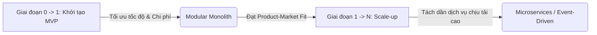
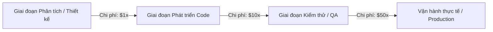
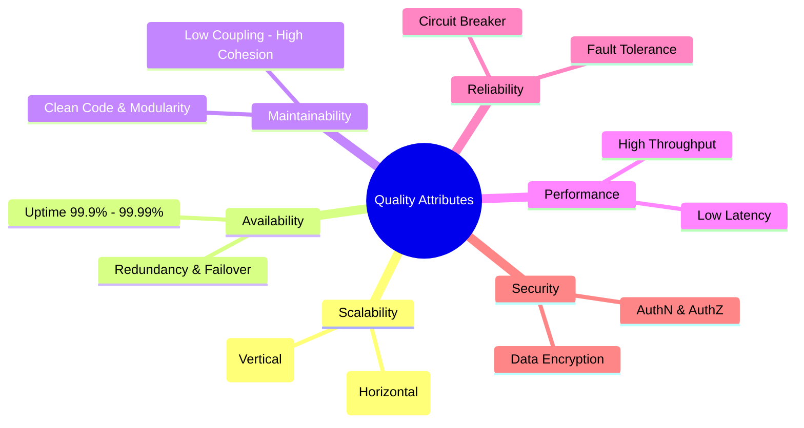

# [BÀI TẬP] TẦM QUAN TRỌNG CỦA KIẾN TRÚC & THUỘC TÍNH CHẤT LƯỢNG
**Chủ đề:** Phân tích Kiến trúc Phần mềm và Thuộc tính chất lượng trong bối cảnh phát triển sản phẩm Startup  
**Vai trò:** Chuyên gia tư vấn giải pháp & kiến trúc hệ thống (Technical Consultant / Solution Architect)  
**Repository:** [NamNT2942003/Microservice-session1](https://github.com/NamNT2942003/Microservice-session1)

---

## 1. Đặt vấn đề & Bối cảnh Startup

> **Tình huống thực tế:** Một startup đang đứng trước ngã ba đường: 
> - *Lựa chọn 1:* Tập trung tối đa vào tốc độ (Speed-to-Market), làm thật nhanh bản MVP (Minimum Viable Product) để đưa ra thị trường kiểm chứng giả thuyết kinh doanh.
> - *Lựa chọn 2:* Đầu tư xây dựng một hệ thống kiến trúc bài bản, bền vững ngay từ đầu để sẵn sàng mở rộng khi lượng người dùng bùng nổ.

### Góc nhìn từ Chuyên gia tư vấn:
Đây là bài toán kinh điển về sự đánh đổi (**Trade-off**) trong kỹ thuật phần mềm. Không có kiến trúc "hoàn hảo tuyệt đối", chỉ có kiến trúc **phù hợp nhất với bài toán kinh doanh và nguồn lực ở từng thời điểm**. 

Một kiến trúc tốt không phải là cố gắng áp dụng những công nghệ phức tạp nhất (như Microservices phân tán trên Kubernetes ngay từ ngày đầu), mà là thiết kế sao cho hệ thống **vừa đủ nhanh để ra mắt, vừa đủ linh hoạt và module hóa để tiến hóa (Evolutionary Architecture)** khi quy mô tăng trưởng.

---

## 2. Câu 1: Tại sao trước khi bắt đầu một dự án, việc chọn kiến trúc lại là bước sống còn?

Việc lựa chọn kiến trúc phần mềm trước khi viết những dòng code đầu tiên mang tính chất **quyết định sự sống còn** của một dự án vì các lý do cốt lõi sau:

### 2.1. Kiến trúc là bản thiết kế móng (Foundational Blueprint)
Tương tự như việc xây một tòa nhà, nếu phần móng được thiết kế cho nhà 2 tầng thì không thể nào sau này tùy tiện xây chồng lên thành tòa tháp 50 tầng mà không làm sập toàn bộ công trình. Kiến trúc phần mềm xác định:
- Ranh giới giữa các thành phần nghiệp vụ (Bounded Contexts).
- Phương thức giao tiếp và luồng dữ liệu (Đồng bộ qua REST/gRPC hay Bất đồng bộ qua Message Queue).
- Cách lưu trữ và quản trị dữ liệu (Single Database hay Database-per-Service).

### 2.2. Đường cong chi phí thay đổi (Cost of Change Curve)
Trong công nghệ phần mềm, **chi phí sửa chữa sai lầm tăng theo cấp số nhân theo thời gian**:
- Sửa đổi kiến trúc trên bản thiết kế/giai đoạn đầu: *Chi phí rất thấp (vài giờ thảo luận)*.
- Sửa đổi khi đã viết xong code: *Tốn kém (vài tuần refactor)*.
- Sửa đổi khi hệ thống đã vận hành với dữ liệu thực tế và hàng trăm nghìn người dùng: *Cực kỳ nguy hiểm, tốn kém hàng tháng trời và tiềm ẩn rủi ro mất dữ liệu, gián đoạn kinh doanh*.

### 2.3. Kiểm soát nợ kỹ thuật (Managing Technical Debt)
Nếu bắt đầu mà không có định hướng kiến trúc, mã nguồn sẽ nhanh chóng trở thành **"Big Ball of Mud"** (mớ bòng bong code gắn kết chặt chẽ - tight coupling). Ban đầu tính năng có thể ra mắt nhanh, nhưng sau vài tháng:
- Thêm một tính năng mới làm gãy 3 tính năng cũ.
- Tốc độ phát triển giảm dần về 0.
- Chi phí bảo trì và sửa lỗi nuốt chửng ngân sách công ty.

### 2.4. Luật Conway (Conway's Law) & Định hình tổ chức nhóm
> *"Các tổ chức thiết kế hệ thống có xu hướng tạo ra các thiết kế phản ánh chính cấu trúc giao tiếp của tổ chức đó."*

Kiến trúc quyết định cơ cấu nhân sự:
- Kiến trúc Monolith phù hợp với một nhóm nhỏ 3–8 lập trình viên cùng làm việc chặt chẽ.
- Kiến trúc Microservices đòi hỏi nhiều nhóm độc lập (Cross-functional teams), đi kèm văn hóa DevOps và quy trình CI/CD tự động hóa cao.

---

## 3. Câu 2: Phân tích các loại kiến trúc phần mềm phổ biến

Dưới đây là 4 mẫu kiến trúc phần mềm tiêu biểu, cơ chế hoạt động, ưu/nhược điểm và trường hợp ứng dụng thực tế:

| Loại kiến trúc | Khái niệm & Cơ chế | Ưu điểm | Nhược điểm | Trường hợp nên áp dụng |
| :--- | :--- | :--- | :--- | :--- |
| **1. Monolithic Architecture** *(Kiến trúc Đơn khối)* | Toàn bộ hệ thống (UI, Business Logic, Data Access) được đóng gói và triển khai thành một khối duy nhất (Single Deployable Unit), chia sẻ chung một Database. | - Phát triển nhanh ban đầu - Dễ test end-to-end và debug - Chi phí hạ tầng thấp - Độ trễ thấp (gọi hàm in-memory) | - Khó scale riêng lẻ từng phần - Single point of failure (lỗi 1 module có thể sập cả app) - Ràng buộc chung một stack công nghệ - Khó làm việc khi team đông | - Startup làm MVP - Team nhỏ (< 10 dev) - Nghiệp vụ chưa quá phức tạp và cần ra mắt nhanh |
| **2. Microservices Architecture** *(Kiến trúc Vi dịch vụ)* | Hệ thống được chia nhỏ thành nhiều service độc lập, mỗi service quản lý một nghiệp vụ riêng biệt, có database riêng (Database-per-Service) và giao tiếp qua API (REST/gRPC) hoặc Message Broker. | - Khả năng mở rộng độc lập (Independent Scalability) - Cách ly lỗi (Fault Isolation) - Tự do lựa chọn công nghệ cho từng service - Triển khai độc lập (CI/CD nhanh) | - Độ phức tạp vận hành và triển khai cực cao - Khó đảm bảo tính nhất quán dữ liệu (Eventual Consistency, Distributed Transactions) - Độ trễ mạng (Network Latency) - Khó trace và debug lỗi phân tán | - Hệ thống quy mô lớn, tải cao - Doanh nghiệp có nhiều team phát triển độc lập - Các domain nghiệp vụ đã được phân định rõ ràng |
| **3. Event-Driven Architecture (EDA)** *(Kiến trúc Hướng sự kiện)* | Các thành phần giao tiếp bất đồng bộ thông qua sự kiện (Events). Producer phát sinh sự kiện lên Event Bus / Message Broker (Kafka, RabbitMQ) và các Consumer đăng ký nhận để xử lý độc lập. | - Mức độ ghép nối cực lỏng (High Decoupling) - Thông lượng xử lý cao (High Throughput) - Khả năng chịu tải đột biến (Traffic Spike Smoothing) - Phản hồi theo thời gian thực | - Khó theo dõi luồng thực thi (Non-linear control flow) - Cần xử lý chống trùng lặp thông điệp (Idempotency) - Đòi hỏi giám sát hạ tầng broker chặt chẽ | - Hệ thống E-commerce (xử lý đơn hàng, thanh toán) - Hệ thống IoT, Notification, Real-time Tracking, Streaming dữ liệu |
| **4. Serverless Architecture (FaaS)** *(Kiến trúc Không máy chủ)* | Ứng dụng được chia thành các hàm xử lý logic (Functions) chạy trên nền tảng Cloud (AWS Lambda, GCP Cloud Functions). Nhà cung cấp tự động cấp phát và mở rộng hạ tầng. | - Chi phí tối ưu: Chỉ trả tiền khi có request (Pay-per-execution, = 0 khi không có tải) - Tự động mở rộng gần như tức thì - Không tốn công bảo trì server hạ tầng | - Độ trễ khởi động ban đầu (Cold Start) - Bị phụ thuộc vào nhà cung cấp (Vendor Lock-in) - Giới hạn thời gian chạy của mỗi hàm (Execution Timeout) - Khó test toàn diện ở local | - Tác vụ xử lý ngầm định kỳ (Cronjobs) - Webhook handlers - Xử lý file/hình ảnh khi upload - MVP cần tối thiểu hóa chi phí hạ tầng ban đầu |

---

## 4. Câu 3: Các thuộc tính chất lượng phần mềm (Quality Attributes / NFRs)

Thuộc tính chất lượng (Non-Functional Requirements - NFRs) là các tiêu chí đánh giá mức độ **vận hành hiệu quả, an toàn và bền vững** của hệ thống, vượt ra ngoài các yêu cầu chức năng đơn thuần (hệ thống làm được gì).

### 4.1. Scalability (Khả năng mở rộng)
- **Định nghĩa:** Khả năng hệ thống duy trì hiệu năng ổn định khi khối lượng công việc (traffic, dung lượng dữ liệu, số lượng người dùng đồng thời) tăng lên bằng cách bổ sung thêm tài nguyên.
- **Phân loại:**
  - *Vertical Scaling (Scale-up):* Nâng cấp phần cứng của server hiện tại (tăng CPU, RAM, SSD).
  - *Horizontal Scaling (Scale-out):* Thêm nhiều máy chủ/node vào cụm xử lý và phân phối tải bằng Load Balancer.

### 4.2. Availability (Độ sẵn sàng)
- **Định nghĩa:** Tỷ lệ thời gian hệ thống hoạt động bình thường và người dùng có thể truy cập, sử dụng dịch vụ mà không bị gián đoạn.
- **Cách đo lường:** Thường được biểu diễn bằng "các chữ số 9":
  - `99.9%` (Three Nines): Thời gian chết (downtime) tối đa ~8.76 giờ/năm.
  - `99.99%` (Four Nines): Downtime tối đa ~52.6 phút/năm.
- **Giải pháp đạt được:** Dự phòng tài nguyên (Redundancy), Tự động chuyển vùng dự phòng (Failover), Triển khai Multi-Zone/Multi-Region.

### 4.3. Maintainability (Khả năng bảo trì)
- **Định nghĩa:** Mức độ dễ dàng và an toàn khi các kỹ sư muốn sửa lỗi, tối ưu hiệu năng, thay đổi logic hoặc tích hợp tính năng mới vào hệ thống mà không gây lỗi dây chuyền.
- **Yếu tố quyết định:** Mã nguồn tuân thủ nguyên lý SOLID, Clean Architecture, độ ghép nối lỏng (Low Coupling), tính gắn kết cao (High Cohesion) và có độ bao phủ kiểm thử tự động (Unit/Integration Test Coverage) cao.

### 4.4. Performance & Latency (Hiệu năng & Độ trễ)
- **Định nghĩa:** Tốc độ phản hồi (Response Time / Latency) và năng lực xử lý số lượng yêu cầu trong một đơn vị thời gian (Throughput / Requests Per Second - RPS).
- **Giải pháp tối ưu:** 
  - Đưa Caching đa tầng (Redis, Memcached, CDN).
  - Tối ưu hóa Database (Indexing, Query Tuning, Connection Pooling).
  - Xử lý bất đồng bộ (Asynchronous / Non-blocking I/O).

### 4.5. Reliability & Fault Tolerance (Độ tin cậy & Khả năng chịu lỗi)
- **Định nghĩa:** Khả năng hệ thống tiếp tục hoạt động chính xác ngay cả khi một số thành phần phần cứng hoặc phần mềm gặp sự cố đột ngột.
- **Kỹ thuật áp dụng:**
  - **Circuit Breaker:** Ngắt kết nối tới service đang gặp sự cố để tránh nghẽn lan truyền.
  - **Retry with Exponential Backoff:** Thử lại request thất bại theo khoảng thời gian tăng dần.
  - **Graceful Degradation:** Tắt bớt tính năng phụ khi hệ thống quá tải để bảo vệ luồng nghiệp vụ cốt lõi.

### 4.6. Security (Tính bảo mật)
- **Định nghĩa:** Khả năng bảo vệ hệ thống, tài nguyên và dữ liệu người dùng khỏi các cuộc tấn công, rò rỉ hoặc truy cập trái phép.
- **Trọng tâm:** Xác thực & Phân quyền chặt chẽ (OAuth2, JWT, RBAC/ABAC), Mã hóa dữ liệu (Encryption in Transit qua HTTPS/TLS và Encryption at Rest qua AES-256), Kiểm soát lỗ hổng bảo mật (OWASP Top 10).

---

## 5. Tổng kết: Mối quan hệ giữa "Kiến trúc tốt" và "Sự thành công của dự án"

Kiến trúc phần mềm không phải là một đích đến cố định, mà là một **phương tiện chiến lược phục vụ mục tiêu kinh doanh**.

### Mối tương quan trực tiếp:
1. **Kiến trúc tốt tạo ra sự linh hoạt kinh doanh (Business Agility):** Giúp doanh nghiệp nhanh chóng thích ứng với sự thay đổi của thị trường, xoay trục sản phẩm (pivot) và tích hợp đối tác mới một cách mượt mà.
2. **Kiến trúc tốt bảo vệ nguồn tài chính của Startup:** Tránh tình trạng lãng phí hàng tháng trời đập đi xây lại hệ thống, tối ưu chi phí hạ tầng đám mây và giảm chi phí vận hành bảo trì.
3. **Kiến trúc tốt nâng cao trải nghiệm người dùng (UX):** Hệ thống nhanh, mượt mà, không gián đoạn (high availability) giúp giữ chân khách hàng và tạo dựng niềm tin thương hiệu.

### Lời khuyên tư vấn cuối cùng cho Startup:
> **"Start with a well-structured Modular Monolith, design clean domain boundaries, and evolve into Microservices only when scale and team growth demand it."**
> *(Bắt đầu với một khối Monolith được module hóa rõ ràng, giữ ranh giới nghiệp vụ sạch sẽ, và chỉ chuyển đổi sang Microservices khi quy mô tải và đội ngũ thực sự yêu cầu.)*
