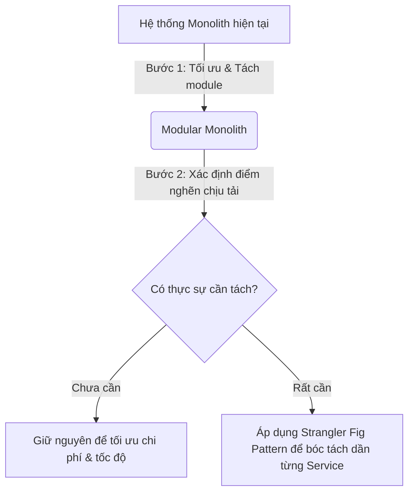

# [BÀI TẬP] CÂN NHẮC BÀI TOÁN ĐÁNH ĐỔI VỚI MICROSERVICES
**Chủ đề:** Phân tích Ưu - Nhược điểm và Đánh giá Rủi ro khi chuyển đổi sang Microservices  
**Vai trò:** Chuyên gia tư vấn kiến trúc phần mềm  
**Repository:** [NamNT2942003/Microservice-session1](https://github.com/NamNT2942003/Microservice-session1)

---

## 1. Đặt vấn đề: Microservices không phải là "Viên đạn bạc"

> **Bối cảnh:** Một doanh nghiệp muốn "đập đi xây lại" toàn bộ hệ thống Monolith cũ để chuyển sang Microservices theo trào lưu công nghệ vì nghe nói nó rất "hot" và hiện đại.

### Lời cảnh báo từ chuyên gia:
Trong kỹ thuật phần mềm, nguyên lý bất biến là: **"Không có bữa trưa nào miễn phí" (There's No Free Lunch)** và **"Không có viên đạn bạc" (No Silver Bullet)**. 

Microservices không tự động giải quyết các vấn đề về hiệu năng hay quản lý code, mà nó chỉ **chuyển đổi bản chất của sự phức tạp** từ *trong lòng ứng dụng (In-Process / Code level)* sang *hạ tầng mạng và vận hành (Network & Operational level)*.

---

## 2. Bảng so sánh chi tiết: Monolith vs Microservices

| Tiêu chí | Monolithic Architecture | Microservices Architecture |
| :--- | :--- | :--- |
| **Ưu điểm nổi bật** | - **Dễ phát triển & kiểm thử:** Chạy và debug trực tiếp trên 1 máy local. - **Đơn giản trong vận hành:** Chỉ cần deploy 1 gói phần mềm duy nhất. - **Dữ liệu nhất quán tuyệt đối:** Sử dụng giao dịch ACID truyền thống trong 1 Database. - **Độ trễ cực thấp:** Giao tiếp qua gọi hàm nội bộ (in-memory call). | - **Mở rộng linh hoạt (Fine-grained Scalability):** Service nào chịu tải cao thì scale riêng service đó, tiết kiệm tài nguyên. - **Độc lập công nghệ (Polyglot):** Mỗi service có thể dùng ngôn ngữ/database phù hợp nhất (Go, Java, Node.js, Python...). - **Cô lập lỗi (Fault Isolation):** Một service sập không kéo theo sập toàn bộ hệ thống. - **Tự chủ nhóm (Autonomous Teams):** Nhiều team phát triển và deploy độc lập mà không cần chờ nhau. |
| **Nhược điểm & Thách thức** | - **Khó mở rộng quy mô lớn:** Phải nhân bản toàn bộ ứng dụng khi scale. - **Single Point of Failure:** Một lỗi tràn bộ nhớ ở 1 tính năng có thể làm sập toàn bộ ứng dụng. - **Ràng buộc công nghệ:** Khó nâng cấp hoặc thử nghiệm công nghệ mới. - **Nghẽn cổ chai khi team đông:** Nhiều team cùng sửa chung 1 codebase dễ gây conflict. | - **Độ trễ mạng & Rủi ro mất kết nối (Network Latency & Failure):** Giao tiếp qua mạng (HTTP/gRPC) chậm hơn gọi hàm và có nguy cơ lỗi đường truyền. - **Mất tính nhất quán dữ liệu tức thời:** Không còn ACID; phải chấp nhận tính nhất quán sau cùng (*Eventual Consistency*) và xử lý phức tạp qua *Saga Pattern*. - **Vận hành & Giám sát cực kỳ phức tạp:** Cần hệ thống CI/CD tự động, Container (Docker), Orchestration (Kubernetes), Distributed Tracing (Jaeger), Centralized Logging (ELK). - **Khó debug & tái hiện lỗi:** Luồng request đi qua hàng chục service khác nhau. - **Chi phí hạ tầng và đội ngũ rất cao:** Đòi hỏi kỹ sư có trình độ DevOps và tư duy phân tán vững vàng. |

---

## 3. Các rủi ro thực tế khi "Đập đi xây lại" sang Microservices

Nếu doanh nghiệp vội vàng chuyển đổi chỉ vì trào lưu mà chưa chuẩn bị kỹ, họ sẽ đối mặt với các rủi ro nghiêm trọng:

1. **Rủi ro tạo ra "Distributed Monolith" (Khối đơn phân tán):**
   - Nếu phân chia ranh giới nghiệp vụ (domain boundaries) sai, các service vẫn phụ thuộc chặt chẽ vào nhau. 
   - Hậu quả: Hệ thống vừa gánh chịu toàn bộ nhược điểm của Monolith (thay đổi một chỗ phải deploy lại tất cả), vừa gánh thêm độ trễ mạng và sự phức tạp của Microservices.

2. **Đình trệ hoạt động kinh doanh (Business Stagnation):**
   - Việc "đập đi xây lại" (Big Bang Rewrite) thường kéo dài từ 6 tháng đến hàng năm.
   - Trong thời gian này, doanh nghiệp không thể ra mắt tính năng mới cho khách hàng, dẫn đến mất thị phần vào tay đối thủ.

3. **Gánh nặng chi phí hạ tầng và nhân sự:**
   - Chi phí thuê server cloud (AWS/GCP), cơ sở dữ liệu phân tán, message broker và các công cụ giám sát tăng vọt.
   - Đội ngũ hiện tại bị quá tải vì thiếu kỹ năng về hệ thống phân tán (Distributed Systems).

---

## 4. Lời khuyên tư vấn cho Doanh nghiệp

1. **Tuyệt đối không áp dụng "Big Bang Rewrite":** Không đập bỏ toàn bộ hệ thống đang mang lại doanh thu.
2. **Bắt đầu bằng cách dọn dẹp nội bộ (Modular Monolith):** Chia lại cấu trúc code thành các module có ranh giới rõ ràng trong cùng một ứng dụng.
3. **Chỉ tách sang Microservices khi có lý do thực sự chính đáng:**
   - Khi một module nghiệp vụ cụ thể cần chịu tải vượt trội (ví dụ: Thanh toán, Tìm kiếm).
   - Khi một nhóm phát triển đã quá đông và cần làm việc độc lập.
4. **Áp dụng mô hình Strangler Fig Pattern:** Bóc tách từng phần nhỏ chuyển ra service riêng, phần còn lại vẫn chạy trên Monolith cũ cho đến khi chuyển đổi hoàn tất an toàn.
