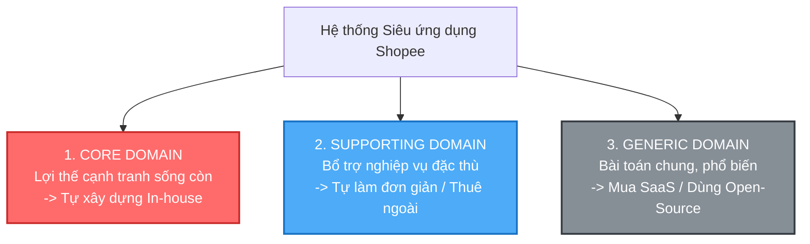
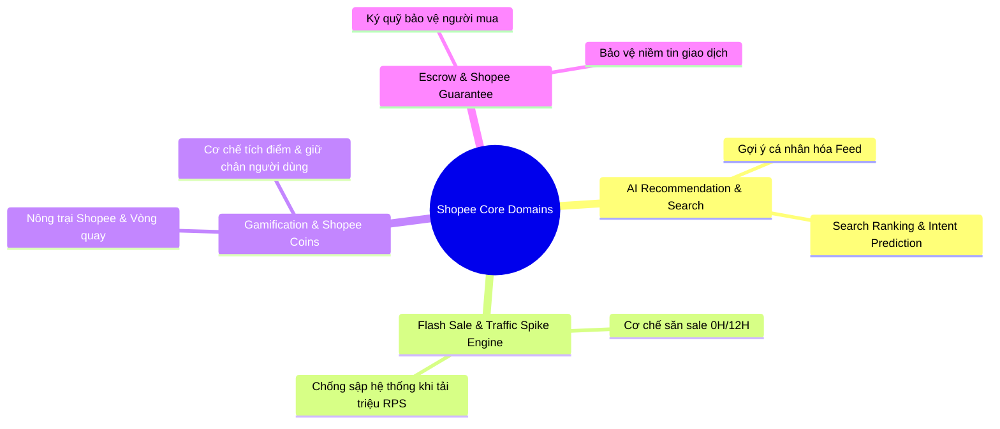
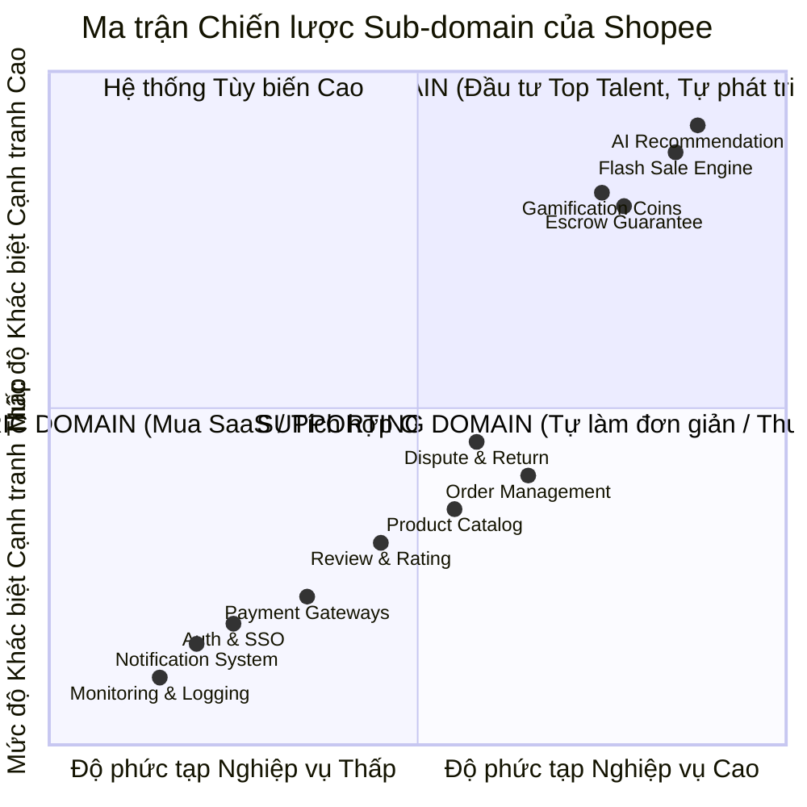

# [BÀI TẬP 5 - XUẤT SẮC] PHÂN TÍCH SHOPEE THEO SUB-DOMAIN (TƯ DUY DDD)
**Chủ đề:** Phân tích Chiến lược Miền nghiệp vụ (Domain-Driven Design Strategic Analysis) cho Siêu ứng dụng Shopee  
**Mức độ:** Bài tập Xuất sắc (Bài tập 5)  
**Vai trò:** Chuyên gia tư vấn Chiến lược Kiến trúc Doanh nghiệp (Enterprise Domain Strategist)  
**Repository:** [NamNT2942003/Microservice-session1](https://github.com/NamNT2942003/Microservice-session1)

---

## 1. Đặt vấn đề & Khái niệm Chiến lược Sub-domain trong DDD

Trong Domain-Driven Design (DDD), **Strategic Design (Thiết kế Chiến lược)** là bước quan trọng nhất giúp lãnh đạo công nghệ và kỹ sư xác định: **"Đâu là phần quan trọng nhất của doanh nghiệp cần đầu tư nhân lực giỏi nhất và ngân sách lớn nhất?"**

Doanh nghiệp không nên phân bổ nguồn lực đồng đều cho mọi module. Thay vào đó, toàn bộ hệ thống Shopee được phân rã thành 3 nhóm Sub-domain:

---

## 2. Phân loại Chi tiết các Module của Shopee vào 3 Nhóm Sub-domain

---

### Nhóm 1: CORE DOMAIN (Miền Cốt Lõi - Tạo nên Sự Khác Biệt Cạnh Tranh Của Shopee)

> **Định nghĩa:** Là "trái tim" và "bí quyết kinh doanh" độc quyền của Shopee. Đây là những module giúp Shopee đánh bại các đối thủ (Lazada, Tiki, TikTok Shop), tạo ra tỷ lệ chuyển đổi đơn hàng cao nhất và giữ chân khách hàng.
> **Chiến lược đầu tư:** Tuyệt đối **tự phát triển In-house (Custom Build)** bởi những kỹ sư, nhà khoa học dữ liệu (Data Scientists) giỏi nhất; áp dụng thiết kế domain chặt chẽ nhất.

#### 1. Search & AI Personalized Recommendation (Tìm kiếm & Gợi ý Cá nhân hóa)
- **Giá trị khác biệt:** Khả năng hiểu hành vi người dùng trong thời gian thực để gợi ý sản phẩm tại mục "Gợi ý hôm nay", "Sản phẩm tương tự" và tối ưu hóa thứ hạng tìm kiếm (*Search Ranking*). Thuật toán này trực tiếp quyết định doanh thu (GMV) và thời gian người dùng lưu lại trên app.

#### 2. Flash Sale & High-Concurrency Engine (Cơ chế Săn Sale Khung giờ vàng)
- **Giá trị khác biệt:** Khả năng xử lý hàng triệu lượt click tranh mua cùng 1 giây (*Traffic Spike Smoothing*) trong các khung giờ 0H/12H các ngày Mega Sale (11.11, 12.12). Logic tranh voucher, giữ kho microsecond và chống gian lận/bot đặt hàng là vũ khí độc quyền của Shopee.

#### 3. Gamification & Shopee Loyalty Engine (Trò chơi & Tích điểm Shopee Xu)
- **Giá trị khác biệt:** Các mini-game như *Nông trại Shopee, Thú cưng, Lắc siêu xu* gắn liền với cơ chế hoàn xu giúp Shopee biến hành vi mua sắm thành trải nghiệm giải trí (*Shoppertainment*), tạo thói quen mở app hàng ngày cho hàng chục triệu người dùng.

#### 4. Shopee Guarantee & Escrow Mechanism (Cơ chế Đảm bảo & Ký quỹ an toàn)
- **Giá trị khác biệt:** Cơ chế tài chính cốt lõi: Shopee giữ tiền của người mua và chỉ giải ngân cho người bán khi đơn hàng giao thành công không có khiếu nại. Đây là yếu tố xây dựng niềm tin số 1 thúc đẩy thương mại điện tử bùng nổ tại Đông Nam Á.

---

### Nhóm 2: SUPPORTING DOMAIN (Miền Hỗ Trợ - Nghiệp vụ Bổ trợ Đặc thù)

> **Định nghĩa:** Những tính năng cần thiết để hệ thống vận hành trơn tru và có tính chất đặc thù theo luồng nghiệp vụ của Shopee, nhưng **không tạo ra sự khác biệt độc quyền** so với đối thủ.
> **Chiến lược đầu tư:** Tự phát triển nội bộ ở mức độ vừa phải, hoặc thuê đối tác ngoài (Outsource) gia công theo đặc tả nghiệp vụ để tiết kiệm chi phí.

| Module | Vai trò nghiệp vụ hỗ trợ | Tại sao là Supporting Domain? |
| :--- | :--- | :--- |
| **Order Management (OMS)** | Quản lý vòng đời đơn hàng, giỏ hàng và thanh toán. | Là luồng bắt buộc của mọi sàn E-commerce; Shopee cần tùy biến quy trình xử lý đơn nhưng không phải là bí mật cạnh tranh độc quyền. |
| **Product Catalog & Seller Management** | Quản lý danh mục hàng hóa, phân loại SKU, quản lý gian hàng Shopee Mall / Shop thường. | Nghiệp vụ tiêu chuẩn về quản lý kho hàng và thông tin sản phẩm của người bán. |
| **Review, Rating & Media Censorship** | Cho phép đánh giá sao, bình luận, đăng tải hình ảnh và lọc từ ngữ vi phạm. | Cần thiết để xây dựng uy tín shop, nhưng tuân theo mô hình review tiêu chuẩn của ngành bán lẻ. |
| **Customer Dispute & Returns (Xử lý khiếu nại & Trả hàng)** | Quy trình tiếp nhận yêu cầu trả hàng, hòa giải giữa người mua và người bán, hoàn tiền. | Nghiệp vụ hậu mãi quan trọng để bảo vệ khách hàng, hỗ trợ cho mô hình Shopee Guarantee. |

---

### Nhóm 3: GENERIC DOMAIN (Miền Dùng Chung - Tiêu chuẩn Phổ quát)

> **Định nghĩa:** Các bài toán kỹ thuật hoặc nghiệp vụ cơ bản mà **bất kỳ hệ thống phần mềm nào cũng cần có**, không mang tính chất đặc thù của Shopee. Thị trường đã có sẵn các giải pháp tiêu chuẩn rất tốt.
> **Chiến lược đầu tư:** **Mua giải pháp có sẵn (Buy SaaS / COTS)** hoặc sử dụng **Thư viện / Mã nguồn mở (Open-Source)**. Tuyệt đối không tự viết lại từ đầu để tránh lãng phí tiền bạc và thời gian.

| Module | Giải pháp đề xuất (Buy / Open-Source) | Lý do không tự viết lại |
| :--- | :--- | :--- |
| **Notification Service (Push/SMS/Email)** | Firebase Cloud Messaging (FCM), Twilio, SendGrid, Amazon SES/SNS. | Đã có các dịch vụ toàn cầu xử lý tối ưu việc gửi tin nhắn đa kênh với độ tin cậy cực cao. |
| **Authentication & SSO (Định danh)** | Keycloak, Auth0, AWS Cognito; Tích hợp OAuth2/OIDC của Google, Facebook, Apple. | Các chuẩn bảo mật đã được chuẩn hóa quốc tế; tự viết lại dễ gây lỗ hổng bảo mật nghiêm trọng. |
| **Payment Gateway Integration** | Tích hợp cổng thanh toán: CyberSource, Stripe, VNPay, Napas, Momo. | Tuân thủ chuẩn bảo mật thẻ quốc tế (PCI-DSS); kết nối trực tiếp với mạng lưới ngân hàng có sẵn. |
| **Live Chat Infrastructure** | Sendbird, Agora.io, Socket.io, Matrix. | Hạ tầng truyền tải tin nhắn thời gian thực (WebRTC/WebSocket) đã có sẵn các SDK tối ưu cao. |
| **Observability, Logging & Monitoring** | ELK Stack, Prometheus, Grafana, Datadog, Jaeger Tracing. | Bộ công cụ tiêu chuẩn công nghiệp cho việc giám sát hệ thống phân tán. |

---

## 3. Ma trận Phân loại Chiến lược (Strategic Domain Matrix)

Sơ đồ ma trận 4 góc phần tư giúp trực quan hóa vị trí của từng module trong bản đồ chiến lược công nghệ của Shopee:

---

## 4. Bài học Tư duy Chiến lược cho Lãnh đạo Công nghệ

1. **Tập trung hỏa lực vào Core Domain:** Doanh nghiệp thành bại ở Core Domain. Nếu Shopee chỉ có hệ thống Notification hoàn hảo hay màn hình Đăng nhập đẹp nhưng thuật toán Gợi ý sản phẩm kém và hệ thống sập vào ngày Flash Sale thì Shopee sẽ thất bại.
2. **Không rơi vào bẫy "Not Invented Here" (Tự chế lại bánh xe):** Cố gắng tự viết hệ thống gửi Email, tự viết thư viện Auth hay tự dựng server chat từ đầu là sự lãng phí tài nguyên nghiêm trọng.
3. **Phân bổ nhân sự chính xác:**
   - **Kỹ sư Senior giỏi nhất, Data Scientists:** Phụ trách *Recommendation, Search, Flash Sale Engine, Escrow*.
   - **Kỹ sư thông thường / Đội ngũ Outsource:** Phụ trách *Catalog, Order CRUD, Review System*.
   - **Kỹ sư DevOps / Integration:** Tích hợp các dịch vụ *SaaS, Cloud Infrastructure, Third-party Gateways*.
