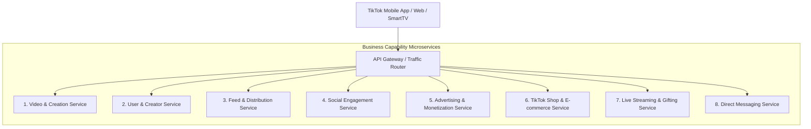
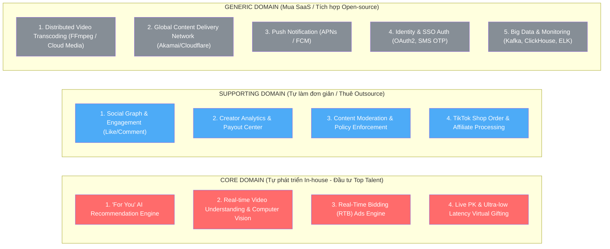

# [BÀI TẬP 6 - XUẤT SẮC] KIẾN TRÚC HÓA MẠNG XÃ HỘI TIKTOK
**Chủ đề:** Phân tách Kiến trúc Hệ thống Siêu tải (Hyper-Scale) bằng 2 phương pháp: Business Capability và Sub-domain (DDD)  
**Mức độ:** Bài tập Xuất sắc (Bài tập 6)  
**Vai trò:** Tổng công trình sư Kiến trúc Hệ thống (Chief Enterprise Architect)  
**Repository:** [NamNT2942003/Microservice-session1](https://github.com/NamNT2942003/Microservice-session1)

---

## 1. Đặt vấn đề & Bối cảnh Siêu tải của TikTok

TikTok là nền tảng video ngắn hàng đầu thế giới với hơn 1 tỷ người dùng hoạt động hàng ngày (DAU), xử lý hàng triệu video tải lên mỗi ngày và phục vụ hàng tỷ lượt xem video đồng thời với độ trễ tính bằng mili-giây.

Để xây dựng một hệ thống chịu tải khổng lồ và linh hoạt, chúng ta áp dụng 2 phương pháp luận phân tách kiến trúc Microservices:
1. **Cách 1: Phân tách theo Năng lực kinh doanh (Business Capability)** - Hướng tiếp cận chức năng nghiệp vụ (*Functional Decomposition*).
2. **Cách 2: Phân tách theo Miền chiến lược (Sub-domain - DDD)** - Hướng tiếp cận giá trị cạnh tranh (*Strategic Value Decomposition*).

---

## 2. Cách 1: Phân rã theo Năng lực Kinh doanh (Business Capability)

Phương pháp này phân chia hệ thống theo các đơn vị kinh doanh và chức năng nghiệp vụ mà người dùng và doanh nghiệp nhìn thấy:

### Chi tiết các Module chính:

1. **Video & Content Creation Service:**
   - Quản lý quá trình tải lên video (Upload), xử lý metadata, gắn hashtag, bài hát/âm thanh nền (*Soundtrack*), hiệu ứng AR/Filter và bản quyền âm nhạc.
2. **User & Creator Management Service:**
   - Quản lý hồ sơ người dùng, quản lý tài khoản nhà sáng tạo (*Creator Verification - Tích xanh*), đồ thị quan hệ theo dõi (*Follow/Unfollow Graph*), danh sách chặn và quyền riêng tư.
3. **Feed & Content Delivery Service:**
   - Phân phối luồng video đến người dùng: Luồng "Dành cho bạn" (*For You Page - FYP*), Luồng "Đang theo dõi" (*Following*), Luồng "Bạn bè" (*Friends*), kết nối hạ tầng mạng phân phối nội dung (CDN).
4. **Social Interaction & Engagement Service:**
   - Xử lý các tương tác thời gian thực với lượng tải siêu lớn: Thả tim (*Like*), Bình luận đa cấp (*Threaded Comments*), Chia sẻ (*Share*), Lưu video (*Bookmark*), Duet và Stitch.
5. **Advertising & Monetization Service (TikTok Ads):**
   - Nền tảng quảng cáo: Quản lý chiến dịch, đấu thầu quảng cáo thời gian thực (*Real-Time Bidding - RTB*), phân phối quảng cáo xen kẽ video (*In-Feed Ads, TopView*), theo dõi chuyển đổi và báo cáo số liệu doanh thu.
6. **TikTok Shop & E-commerce Service:**
   - Nền tảng mua sắm tích hợp: Quản lý giỏ hàng, liên kết sản phẩm trong video/livestream, tiếp thị liên kết (*Creator Affiliate*), điều phối đơn hàng và hoa hồng.
7. **Live Streaming & Virtual Gifting Service:**
   - Phát trực tiếp video thời gian thực độ trễ thấp (WebRTC/RTMP), phòng chat trực tiếp, cơ chế tặng quà ảo 3D (*Virtual Gifts*) và đấu trường PK Live.
8. **Direct Messaging (DM) Service:**
   - Nhắn tin trực tiếp 1-1, chat nhóm, chia sẻ video TikTok riêng tư giữa người dùng theo thời gian thực.

---

## 3. Cách 2: Phân rã theo Chiến lược Sub-domain (Domain-Driven Design)

Phương pháp này phân chia dựa trên **bản chất giá trị chiến lược và mức độ khác biệt cạnh tranh**, giúp xác định rõ mức độ ưu tiên đầu tư:

### Phân tích chi tiết 3 nhóm Sub-domain:

#### A. CORE DOMAIN (Miền Cốt Lõi - Bí quyết sống còn độc quyền của TikTok)
1. **"For You" AI Recommendation Engine (Thuật toán Gợi ý FYP):**
   - *Bản chất:* Thuật toán Deep Learning / Reinforcement Learning phân tích hành vi từng mili-giây (thời gian xem, tốc độ cuộn, xem lại, bỏ qua) để đưa ra video tiếp theo gây nghiện nhất. Đây là lý do số 1 tạo nên sự thống trị toàn cầu của TikTok.
2. **Real-time Video & Audio Understanding (AI Phân tích Video & Âm thanh):**
   - *Bản chất:* Trích xuất nội dung video, nhận diện khuôn mặt, vật thể, biểu cảm, giọng nói và giai điệu bài hát để tự động gắn thẻ (Tagging) và phân loại video ngay khi người dùng vừa upload.
3. **Real-Time Bidding (RTB) Ads Matching Engine:**
   - *Bản chất:* Thuật toán đấu thầu và chèn quảng cáo thông minh vào đúng đối tượng mà không làm gián đoạn cảm xúc xem video của người dùng.
4. **Live PK & Low-Latency Virtual Gifting Engine:**
   - *Bản chất:* Xử lý hàng chục nghìn quà tặng hiệu ứng 3D xuất hiện cùng một lúc trong các phiên Live PK triệu view mà không làm lag luồng video.

#### B. SUPPORTING DOMAIN (Miền Hỗ Trợ - Nghiệp vụ Bổ trợ Đặc thù)
1. **Social Graph & Engagement:** Lưu trữ số lượng Like, cây Comment, danh sách Follower.
2. **Creator Analytics & Payout Center:** Báo cáo tăng trưởng kênh cho nhà sáng tạo và quy đổi quà ảo thành tiền mặt.
3. **Content Moderation & Policy Enforcement:** Hệ thống gắn cờ nội dung vi phạm tiêu chuẩn cộng đồng kết hợp AI và đội ngũ kiểm duyệt thủ công.
4. **TikTok Shop Order Management:** Xử lý đơn hàng mua sắm liên kết từ video.

#### C. GENERIC DOMAIN (Miền Dùng Chung - Giải pháp Tiêu chuẩn / Mua ngoài)
1. **Video Transcoding & Compression:** Dùng FFmpeg cụm phân tán hoặc Cloud Media Convert (AWS/GCP) để nén video sang các chuẩn H.264, H.265, AV1.
2. **Global CDN Edge Caching:** Sử dụng mạng lưới CDN (Cloudflare, Akamai, Fastly, AWS CloudFront) để đưa video đến gần người dùng nhất.
3. **Push Notification:** FCM, APNs để thông báo khi có người thả tim, comment hoặc Creator bắt đầu Livestream.
4. **User Auth & SMS Gateway:** Keycloak, Twilio SMS OTP, Apple/Google Sign-In.
5. **Observability & Big Data:** Kafka, ClickHouse, Apache Flink, Elasticsearch, Grafana.

---

## 4. So sánh & Đánh giá: Cách chia nào giúp Team phát triển nhanh hơn?

| Tiêu chí so sánh | Phân tách theo Business Capability | Phân tách theo Sub-domain (DDD) |
| :--- | :--- | :--- |
| **Góc nhìn tiếp cận** | **Theo chức năng nghiệp vụ:** Hướng đến người dùng và các luồng tính năng của sản phẩm. | **Theo giá trị chiến lược:** Hướng đến việc phân bổ nguồn lực và mức độ cạnh tranh của doanh nghiệp. |
| **Cơ cấu tổ chức nhóm (Conway's Law)** | **Rất trực quan và rõ ràng:** 1 Team = 1 Capability (Team Video, Team Ads, Team Live, Team Shop). | **Phân cấp theo độ phức tạp:** Nhóm R&D/AI phụ trách Core, nhóm Fullstack/Outsource phụ trách Supporting, nhóm DevOps/Platform phụ trách Generic. |
| **Tốc độ ra mắt tính năng (Speed to Market)** | **Cực kỳ nhanh ở giai đoạn đầu và mở rộng tính năng mới:** Các team hoạt động độc lập từ Front-end đến Back-end (*Cross-functional Feature Teams*). | Cần thời gian phân tích chiến lược ban đầu; tập trung tối ưu chiều sâu hơn là mở rộng chiều rộng. |
| **Hiệu quả đầu tư công nghệ** | Có nguy cơ tự viết lại các module không cần thiết (tự làm transcoding, tự làm auth). | **Tối ưu hóa chi phí tối đa:** Biết rõ cái gì nên mua ngoài (Generic), cái gì nên đầu tư khủng (Core). |

---

### Kết luận: Cách chia nào giúp Team phát triển nhanh hơn?

#### 1. Ở giai đoạn Phát triển Tính năng & Mở rộng Nghiệp vụ (Feature Delivery):
👉 **Phân tách theo Business Capability giúp team phát triển NHANH HƠN.**  
- *Lý do:* Mỗi nhóm sở hữu trọn vẹn một tính năng từ đầu đến cuối (*End-to-End Ownership*). Team TikTok Shop có thể liên tục đẩy tính năng mới lên production mỗi ngày mà không phụ thuộc vào tiến độ của Team Live hay Team Ads.

#### 2. Ở quy mô Siêu ứng dụng & Cạnh tranh Dài hạn (Hyper-Scale & Longevity):
👉 **Phân tách theo Sub-domain (DDD) giúp doanh nghiệp đi NHANH VÀ BỀN VỮNG NHẤT.**  
- *Lý do:* Giúp công ty không bị "sa lầy" tài nguyên vào các thành phần dùng chung (Generic) bằng cách mua ngoài giải pháp có sẵn (CDN, Transcoding, Auth, SMS), từ đó **dồn 80% kỹ sư tinh nhuệ nhất vào Core Domain (Thuật toán FYP & AI Video Understanding)** – yếu tố duy nhất giúp TikTok vượt mặt YouTube Shorts và Instagram Reels.

---

### Mô hình Kết hợp Hoàn hảo (The Hybrid Architecture Model):
> **"Dùng Sub-domain (DDD) để định hướng CHIẾN LƯỢC ĐẦU TƯ (Build vs Buy), sau đó dùng Business Capability để TỔ CHỨC CẤU TRÚC ĐỘI NGŨ & TRIỂN KHAI MICROSERVICES."**
